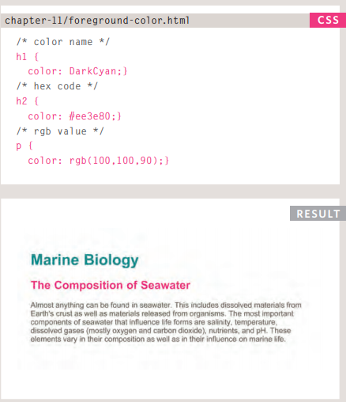

#CSS

## Intordaction to CSS

### What is CSS?
* You can create great-looking websites using CSS.
* CSS is a simple design language intended to simplify the process of making web pages presentable.
* CSS handles the look and feel part of a web page. Using CSS, you can control the color of the text, the style of fonts, the spacing between paragraphs, how columns are sized and laid out, what background images or colors are used, layout designs,variations in display for different devices and screen sizes as well as a variety of other effects.

### Why to use CSS?
1- CSS saves time.
2- Page load faster.
3- Superior styles to HTML.

### Exapmle for CSS with HTML

## Colors

### Why to use colors?
*Color can really bring your pages to life.*

### How to use colors in CSS?
1- rgb values.
2- hex codes.
3- Color names.

### Contrast
It is important to ensure that there is enough contrast
between any text and the background color 

