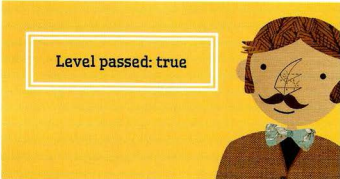

# Operators and Loops


## Comparison Operations

### Evaluating conditiong

Symbol | What it do 
--- | ---
== | is equal to
!= | is not equal to
=== | strict equal to
!== | strict not equal to
> | greater than
< | less than
>= | greater than or equal to
<= | less than or equal to

### Using Comparison Operators

```
var pass = 50; II Pass mark
var score = 90; II Score
II Check if t he user has passed
var hasPassed = score >= pass;
II Write the message i nt o the page
var el = document .getEl ementByld(' answe r ');
e 1 . t extContent = 'Leve 1 passed: ' + has Passed; 
```


### Logical Operators
Comprison operators usually return single values of true or false.
Logical operators allow you to compare the results of more than one comparison operator.

Symbol | What it do
--- | ---
&& | logical and
|| | logical or
! | logical not


## Loops
Loops check a condition if it return true, a code will run, then it will be checked again until it returns false.

### Types of loops
* For.
* While.
* Do While.

### Loops Counters
* Initialization.
var i = 0;
* Condition
i < 10;
* Update
i++

### Using for Loops
```
var scores= [24. 32, 17]; //Array of scores
var arraylength scores.l ength; // Items in array
var roundNumber = O; //Current round
var msg ''; //Message
var i ; // Counter
//Loop through the items in the array
for (i = O; i < arraylength; i++) {
//Arrays are zero based (so 0 is round 1)
//Add 1 to the current round
roundNumber = (i + l);
// Write the current round to message
msg += 'Round ' + roundNumber + ' : ';
//Get the score from the scores array
msg += scores[i] + '<br / >' ;
document .getElementByid( 'answer') .i nnerHTML msg; 
```

### Using while Loops
```
var i = l ;
var msg = ' ' ;
II Set counter to 1
II Message
II Store 5 times tabl e in a variable
while (i < 10) {
msg += i + ' x 5 = ' + (i * 5) + '<br I>';
i++;
document .getEl ementByid( ' answer') . innerHTML = msg; 
```

### Using do while Loops
```
var i = l;
var msg : I I •
•
II Set counter to 1
II Message
II Store 5 times table in a variable
do {
msg += i + ' x 5 = ' + (i * 5) + '<br I>' ;s
i++;
} wh il e ( i < 1) ;
II Note how this is already 1 and it still runs
document .getEl ementByld(' answer').innerHTML = msg; 
```